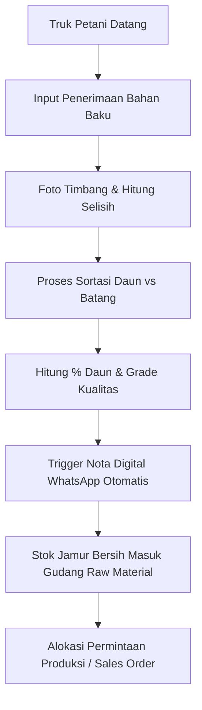
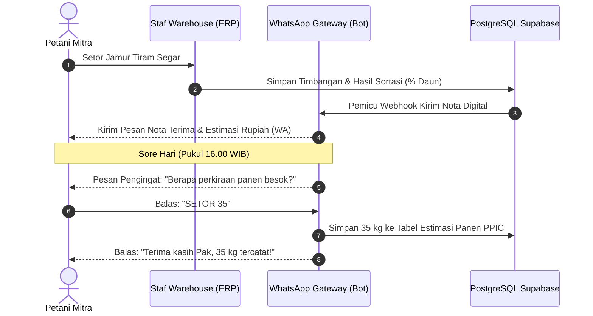

# Product Requirements Document (PRD)
## Spesifikasi Lengkap 6 Role Pengguna, Fitur, Alur Kerja & Input-Output
### Sistem ERP & Ketertelusuran Terpadu — KhumKhum Jamur Crispy (CV Khaira Buana Mas)

**Versi Dokumen:** 2.5 (Comprehensive Role Specification)  
**Tanggal Rilis:** Agustus 2026  
**Klasifikasi:** Dokumen Spesifikasi Kebutuhan Perangkat Lunak (SRS/PRD)  
**Program:** Startup for Industry 2026 – Kementerian Perindustrian Republik Indonesia  
**Target Pengguna Sistem:** Tim Operasional CV Khaira Buana Mas & Petani Mitra Kulon Progo  

---

## 1. Pendahuluan & Filosofi Desain Peran (Role Architecture)

### 1.1 Latar Belakang & Urgensi
Operasional IKM pangan KhumKhum Jamur Crispy melibatkan mata rantai hulu-hilir yang dinamis: dari petani jamur tiram lokal di Kulon Progo, proses sortasi, lini penggorengan dan pembumbuan bertahap, quality control ketat, manajemen persediaan multi-gudang, hingga distribusi ke lebih dari 1.500 titik penjualan di 8 provinsi. 

Untuk menghindari redundansi pencatatan, memitigasi kesalahan manusia (*human error*), serta menjamin integritas data ketertelusuran (*traceability*) tanpa membebani operator lapangan dengan antarmuka yang rumit, hak akses sistem diklasifikasikan ke dalam **6 Peran Pengguna (Core User Roles)** yang terisolasi secara aman menggunakan prinsip *Role-Based Access Control* (RBAC).

### 1.2 Prinsip Dasar RBAC & Aksesibilitas
1. **Prinsip Hak Akses Minimum (*Least Privilege Access*):** Setiap pengguna hanya memiliki akses ke modul, antarmuka, dan endpoint API yang secara mutlak diperlukan untuk menyelesaikan tugas fungsinya.
2. **Efisiensi Peran IKM (*Pragmatic IKM Role Consolidation*):** Menyatukan fungsi gudang, logistik, sales order, dan PPIC ke dalam 1 peran terkoordinasi (`ROLE_WAREHOUSE`) guna mencegah friksi komunikasi pada skala IKM manufaktur.
3. **Pengalaman Pengguna Petani Tanpa Aplikasi (*Zero-App Farmer Experience*):** Petani jamur tidak diwajibkan mengunduh aplikasi atau mengingat kredensial login web. Seluruh interaksi petani (nota timbang, transparansi harga, dan konfirmasi jadwal panen) berjalan otomatis melalui **WhatsApp Gateway & Bot Webhook**.
4. **Jejak Audit Otomatis & Abadi (*Immutable Audit Trail*):** Setiap mutasi data kritikal (*create, update, delete, void*) otomatis mengikat ID Pengguna, stempel waktu (*timestamp* ISO), alamat IP, dan catatan log sebelum-sesudah (*diff snapshot*).

---

## 2. Ringkasan 6 Peran Pengguna & Matriks Hak Akses (RBAC Matrix)

### 2.1 Ringkasan Profil Peran

| ID Role | Nama Role | Kategori Pengguna | Ringkasan Fungsi Utama |
|---|---|---|---|
| `ROLE_SUPER_ADMIN` | **Super Admin** | Sistem & Kepemilikan | Kontrol konfigurasi sistem penuh, manajemen akun user, audit trail, pembatalan (*void*) transaksi, dan integrasi gateway. |
| `ROLE_QC` | **Quality Control & Ops** | Penjamin Mutu | Konfigurasi standar kualitas (% daun, rendemen, defect), inspeksi sampling batch, analisis pareto cacat, serta penetapan status rilis produk. |
| `ROLE_WAREHOUSE` | **Warehouse, Logistics & PPIC** | Gudang, Sales & Rencana | Penerimaan bahan baku jamur, sortasi & grading, trigger nota WA, kelola persediaan multi-lokasi, stock opname, pemrosesan order penjualan, dan forecasting AI. |
| `ROLE_PRODUCTION` | **Petugas Produksi** | Operator Lapangan | Pembuatan batch produksi WIP (`PRD-YYYYMMDD-XXX`), pencatatan input-output penggorengan/pembumbuan, dan monitoring rendemen real-time. |
| `ROLE_MANAGEMENT` | **Manajemen (Viewer)** | Eksekutif & Investor | Pengawasan dashboard KPI bisnis real-time, penelusuran ketertelusuran dua arah (*two-way traceability*), dan ekspor laporan resmi untuk Kemenperin RI. |
| `ROLE_FARMER` | **Petani Mitra** | Pemasok Bahan Baku | Penerimaan nota digital timbangan transparan via WA instan dan konfirmasi ketersediaan panen esok hari via chat interaktif. |

---

### 2.2 Matriks Hak Akses CRUD & Aksi Modul

**Keterangan Simbol Akses:**
* **FULL** : *Create, Read, Update, Delete, Export, Approve, Void/Override*
* **C/R/U** : *Create, Read, Update* (tanpa izin penghapusan/penghilangan data permanen)
* **C/R** : *Create & Read* (pencatatan data baru dan melihat riwayat tanpa izin ubah setelah disimpan)
* **R** : *Read-Only* (hanya melihat data dan mengekspor/mencetak dokumen)
* **-** : *No Access* (menu sidebar tersembunyi, route diproteksi HTTP 403)
* **WA** : *WhatsApp Interactivity* (komunikasi data dua arah via WhatsApp API)

| Modul & Fitur Sistem | Super Admin | QC & Ops | Warehouse & PPIC | Produksi | Manajemen | Petani Mitra |
|---|:---:|:---:|:---:|:---:|:---:|:---:|
| **Manajemen User & Hak Akses** | FULL | - | - | - | - | - |
| **Audit Log & System Monitoring** | FULL | R | - | - | R | - |
| **Konfigurasi Standar Mutu** | FULL | FULL | R | - | R | - |
| **Master Data (Petani, Produk, Gudang)** | FULL | R | C/R/U | - | R | - |
| **Penerimaan Bahan Baku Jamur** | FULL | R | C/R | - | R | WA (Terima Nota) |
| **Sortasi & Grading Jamur** | FULL | R | C/R | - | R | WA (Info Kualitas) |
| **Produksi WIP & Rendemen** | FULL | R | R | C/R | R | - |
| **Quality Control & Defect Analysis** | FULL | C/R/U | R | - | R | - |
| **Persediaan & Kartu Stok Real-Time** | FULL | R | C/R/U | R | R | - |
| **Stock Opname & Rekonsiliasi** | FULL | R | C/R/U | - | R | - |
| **Sales Order & Pengiriman** | FULL | R | C/R/U | - | R | - |
| **PPIC & Forecasting Permintaan** | FULL | R | C/R/U | R | R | - |
| **WhatsApp Gateway & Bot Scheduler** | FULL | R | C/R | - | R | WA (Interaktif) |
| **Ketertelusuran Dua Arah (*Traceability*)** | FULL | FULL (R) | FULL (R) | FULL (R) | FULL (R) | - |
| **Executive KPI Dashboard & Ekspor Laporan** | FULL | R | R | R | FULL (R) | - |

---

### 2.3 Navigasi Sidebar Menu per Role Pengguna

```
┌──────────────────────────────────────────────────────────────────────────────────────────┐
│ MODUL / MENU ERP              │ S.Admin │ QC/Ops │ Warehouse │ Produksi │ Manajemen │
├───────────────────────────────┼─────────┼────────┼───────────┼──────────┼───────────┤
│ 📊 Dashboard Utama            │    ✓    │   ✓    │     ✓     │    ✓     │     ✓     │
│ 👥 Manajemen Pengguna         │    ✓    │   -    │     -     │    -     │     -     │
│ ⚙️ Standar Kualitas           │    ✓    │   ✓    │     R     │    -     │     R     │
│ 🗂️ Master Data Terpadu        │    ✓    │   R    │     ✓     │    -     │     R     │
│ 🚛 Penerimaan & Sortasi       │    ✓    │   R    │     ✓     │    -     │     R     │
│ 🏭 Lini Produksi & Rendemen   │    ✓    │   R    │     R     │    ✓     │     R     │
│ 🔍 Quality Control & Defect   │    ✓    │   ✓    │     R     │    -     │     R     │
│ 📦 Persediaan & Stock Opname  │    ✓    │   R    │     ✓     │    R     │     R     │
│ 🛒 Sales Order & Pengiriman   │    ✓    │   R    │     ✓     │    -     │     R     │
│ 📈 PPIC & Forecasting Permintaan│   ✓   │   R    │     ✓     │    R     │     R     │
│ 💬 WhatsApp Gateway & Log     │    ✓    │   R    │     ✓     │    -     │     R     │
│ 🔗 Ketertelusuran (Traceability)│  ✓    │   ✓    │     ✓     │    ✓     │     ✓     │
│ 📝 Audit Logs & Keamanan      │    ✓    │   R    │     -     │    -     │     ✓     │
└──────────────────────────────────────────────────────────────────────────────────────────┘
```

---

## 3. Rincian Mendalam 6 Peran Pengguna (Fungsi, Fitur, Input & Output)

---

### 3.1 Role 1: Super Admin (`ROLE_SUPER_ADMIN`)

```
┌─────────────────────────────────────────────────────────────────────────────────────────┐
│ PERSONA: Pemilik Usaha / Kepala Divisi IT / Administrator Sistem Utama                  │
│ AKSES PERANGKAT: Desktop / Laptop (Browser Web Terproteksi 2FA)                         │
└─────────────────────────────────────────────────────────────────────────────────────────┘
```

#### A. Fungsi & Tujuan Bisnis Peran
Super Admin bertanggung jawab menjaga kelangsungan operasional sistem ERP, keamanan data perusahaan, konfigurasi parameter master global, pemantauan log audit seluruh staf, serta menangani koreksi/pembatalan (*void transaction*) apabila terjadi anomali kritis pada transaksi lapangan.

#### B. Fitur Lengkap & Alur Kerja
1. **Manajemen Pengguna & Otorisasi RBAC:**
   - Membuat akun staf baru dengan sistem undangan email token terenkripsi (masa berlaku 24 jam).
   - Menetapkan dan mengubah peran pengguna (*Role Assignment*).
   - Mengaktifkan / menonaktifkan akun staf yang mutasi atau berhenti bekerja.
   - Mereset autentikasi dua faktor (2FA) dan membuka blokir akun yang terkunci akibat salah password 5 kali.
2. **Pengaturan Konfigurasi Sistem Global:**
   - Mengatur parameter dasar sistem: toleransi timbangan default (misal ±2%), standar harga beli jamur per kg, zona waktu operasional (WIB/UTC+7), dan ambang batas peringatan stok minimum.
3. **Pusat Log Audit & Monitoring Keamanan (*Security & Audit Trail*):**
   - Melihat riwayat aktivitas seluruh staf secara real-time (waktu, nama staf, role, modul, aksi, IP address, user-agent).
   - Melakukan pelacakan perubahan data (*diff snapshot before vs after*).
4. **Otorisasi Pembatalan Transaksi (*Transaction Void & Override*):**
   - Melakukan pembatalan transaksi penerimaan/sortasi/produksi yang salah input dengan kewajiban mengisi alasan pembatalan resmi (*mandatory audit justification*).
5. **Konfigurasi WhatsApp Gateway Provider:**
   - Mengatur API Key provider (Fonnte/Wablas/Meta API), Webhook Secret Token, nomor bot pengirim resmi, dan menguji koneksi kirim pesan.
6. **Backup Database & Pemeliharaan Sistem:**
   - Memantau penggunaan kuota Supabase PostgreSQL database, Supabase Storage media file, dan memicu backup manual.

#### C. Spesifikasi Input & Validasi

| Komponen Input | Tipe Data & Format | Validasi & Aturan Bisnis | Keterangan |
|---|---|---|---|
| **Nama Lengkap Pengguna** | Text (String 3-100 char) | Wajib diisi, tidak boleh karakter berbahaya/script | Identitas staf resmi |
| **Email Pengguna** | Email format (`user@domain.com`) | Unik di database, format email valid RFC 5322 | Username login & link aktivasi |
| **Penetapan Role** | Enum (`SUPER_ADMIN`, `QC`, dll) | Wajib memilih 1 dari 6 role valid | Menentukan RBAC permission |
| **Nomor WhatsApp Staf** | String E.164 (`628xxxxxxxxxx`) | Format diawali kode negara 62, panjang 10-15 digit | Notifikasi darurat sistem |
| **Toleransi Timbang Global (%)** | Decimal (0.01 - 10.00%) | Default: `2.00%`, batas minimum 0.1% | Ambang batas selisih kirim vs terima |
| **API Token WhatsApp** | String (Encrypted Vault) | Format Bearer token / API secret valid | Akses gateway pengiriman pesan |
| **Alasan Void Transaksi** | Text (Min. 10 karakter) | Wajib diisi saat membatalkan transaksi yang sudah tersimpan | Masuk ke tabel audit log permanen |

#### D. Spesifikasi Output & Efek Samping

| Komponen Output | Format / Media | Rumus / Logika Pembentukan | Tujuan & Penerima |
|---|---|---|---|
| **Email Undangan Aktivasi** | HTML Email via Resend/SMTP | Link aktivasi dengan token JWT kedaluwarsa 24 jam | Dikirim ke staf baru untuk membuat password awal |
| **Log Audit Teragregasi** | Tabel Interaktif & Export CSV | `SELECT * FROM audit_logs ORDER BY created_at DESC` | Bukti kepatuhan hukum & audit forensik internal |
| **Status Konektivitas Sistem** | Visual Widget Card (Green/Red) | Ping API Supabase, Auth Service & WhatsApp Gateway | Mengetahui kesehatan server secara langsung |
| **Status Reversal Transaksi** | Status Tag (`VOIDED` / `CANCELLED`) | Mengembalikan stok item terkait dan menandai record tidak aktif | Integritas pencatatan akuntansi & stok |

---

### 3.2 Role 2: Quality Control & Ops (`ROLE_QC`)

```
┌─────────────────────────────────────────────────────────────────────────────────────────┐
│ PERSONA: Petugas Inspeksi Kualitas / Penjamin Mutu Pangan (Quality Assurance)           │
│ AKSES PERANGKAT: Tablet / Laptop di Area Laboratorium & Lini Finishing                  │
└─────────────────────────────────────────────────────────────────────────────────────────┘
```

#### A. Fungsi & Tujuan Bisnis Peran
Quality Control bertanggung jawab memastikan seluruh jamur tiram yang diterima dari petani dan produk jamur crispy olahan yang dihasilkan memenuhi standar mutu CV Khaira Buana Mas, standar sertifikasi Halal, dan standar SNI pangan olahan, serta menganalisis akar penyebab cacat produksi (*root cause analysis*).

#### B. Fitur Lengkap & Alur Kerja
1. **Konfigurasi Standar Kualitas Mutu (Master Quality Standard):**
   - Mengatur batas ambang persentase daun jamur tiram bersih (default minimum $\ge 75\%$).
   - Mengatur batas ambang rendemen produksi target (default target $\ge 80\%$).
   - Mengelola master daftar kategori defect (Gosong, Keasinan/Bumbu Tidak Rata, Kemasan Bocor/Tidak Rapat, Remuk/Patah Berlebih, Melempem/Kadar Air Tinggi).
2. **Inspeksi Sampel Produk Jadi per Batch Produksi:**
   - Memilih nomor batch produksi (`PRD-YYYYMMDD-XXX`) yang selesai diproses.
   - Memasukkan jumlah sampel yang diuji ($N_{sample}$) menggunakan metode standar *Acceptance Quality Limit* (AQL).
   - Mencatat jumlah temuan produk cacat per masing-masing kategori defect.
   - Mengunggah foto bukti produk cacat jika ditemukan anomali berat.
3. **Penetapan Keputusan Status Batch (*QC Decision*):**
   - **RELEASED:** Produk memenuhi syarat, stok batch otomatis dialokasikan ke Gudang Produk Jadi untuk siap dijual.
   - **REWORK:** Produk membutuhkan proses perbaikan (contoh: penggorengan ulang peniris minyak atau penambahan bumbu).
   - **REJECTED:** Produk cacat berat dan tidak boleh dipasarkan (stok dialihkan ke limbah/afkir).
4. **Analisis Pareto Defect & Tren Mutu:**
   - Menampilkan grafik pareto cacat (80/20 rule) untuk mengidentifikasi 2 cacat paling dominan.
   - Monitoring tren defect rate mingguan dan bulanan.
5. **Pencetakan Sertifikat / Lembar Hasil Uji Mutu (QC Release Certificate):**
   - Menghasilkan dokumen PDF lembar pengesahan batch untuk arsip audit BPOM / Halal.

#### C. Spesifikasi Input & Validasi

| Komponen Input | Tipe Data & Format | Validasi & Aturan Bisnis | Keterangan |
|---|---|---|---|
| **Pilihan No. Batch Produksi** | Dropdown Reference (`PRD-xxxx`) | Hanya batch yang berstatus `COMPLETED_WIP` dan belum di-QC | Mencegah double inspeksi pada batch yang sama |
| **Jumlah Sampel Diperiksa** | Integer Positif ($N > 0$) | Wajib $\ge 1$ bungkus / kg sesuai aturan sampling | Ukuran sampel uji |
| **Jumlah Temuan Cacat per Kategori** | Integer Positif ($\ge 0$) | Total cacat tidak boleh melebihi jumlah sampel diperiksa | Breakdown cacat per jenis |
| **Foto Bukti Cacat** | File Gambar (`JPG/PNG/WEBP`) | Ukuran maks. 5MB, otomatis dikompres sebelum upload | Disimpan di bucket Supabase `qc-evidences` |
| **Keputusan Kualitas** | Radio Enum (`RELEASE`, `REWORK`, `REJECT`) | Wajib dipilih sebelum form disimpan | Mengubah status stok di database |
| **Catatan Inspeksi QC** | Text (String opsional) | Wajib jika memilih `REWORK` atau `REJECT` | Instruksi perbaikan untuk tim produksi |

#### D. Spesifikasi Output & Efek Samping

| Komponen Output | Format / Media | Rumus / Logika Pembentukan | Tujuan & Penerima |
|---|---|---|---|
| **Perhitungan Defect Rate (%)** | Angka Desimal (2 desimal) | $$\text{Defect Rate (\%)} = \left( \frac{\sum \text{Total Produk Cacat}}{N_{\text{sampel diperiksa}}} \right) \times 100\%$$ | Menilai kualitas batch seketika di layar |
| **Status Kunci Batch Stok** | Update Database Otomatis | Jika `RELEASE` $\to$ Stok produk jadi bertambah. Jika `REJECT` $\to$ Masuk kerugian/afkir | Integrasi langsung ke modul Persediaan |
| **Grafik Pareto Cacat** | Diagram Batang & Garis Kumulatif | Mengurutkan kategori cacat dari frekuensi tertinggi ke terendah | Bahan evaluasi briefing harian tim produksi |
| **Sertifikat Kelayakan Mutu (PDF)** | Dokumen PDF Siap Cetak | Berisi data batch, tanggal uji, skor defect rate, tanda tangan digital QC | Arsip kepatuhan jaminan mutu pangan |

---

### 3.3 Role 3: Warehouse, Logistics & PPIC (`ROLE_WAREHOUSE`)

```
┌─────────────────────────────────────────────────────────────────────────────────────────┐
│ PERSONA: Kepala Gudang, Koordinator Logistik, Staf PPIC & Admin Penjualan              │
│ AKSES PERANGKAT: Tablet Tangguh / Laptop di Area Bongkar Muat & Gudang Distribusi       │
└─────────────────────────────────────────────────────────────────────────────────────────┘
```

#### A. Fungsi & Tujuan Bisnis Peran
Role ini memegang kendali atas pintu gerbang fisik IKM: mencatat penerimaan jamur dari petani mitra, melakukan sortasi dan grading, memicu nota digital WhatsApp ke petani, mengontrol stok 5 kategori barang (*Raw, Packaging, Seasoning, WIP, Finished Goods*), menjalankan stock opname, memproses sales order pelanggan ritel/distributor, serta mengeksekusi forecasting permintaan mingguan.

#### B. Fitur Lengkap & Alur Kerja



1. **Modul Penerimaan Bahan Baku Jamur (`RM-YYYYMMDD-XXX`):**
   - Memilih nama Petani Mitra dari daftar master data.
   - Menginput Nomor Surat Jalan Petani dan Berat Kirim dari kebun ($W_{kirim}$ dalam kg).
   - Menimbang jamur di timbangan pabrik dan memasukkan Berat Terima aktual ($W_{terima}$ dalam kg).
   - Mengunggah foto bukti timbangan digital.
   - Sistem memvalidasi selisih timbangan terhadap batas toleransi ($\pm 2\%$).
2. **Modul Sortasi & Grading Bahan Baku:**
   - Mencatat pemisahan bagian jamur: Berat Daun Jamur Bersih ($W_{daun}$) dan Berat Batang Jamur ($W_{batang}$).
   - Sistem menghitung persentase daun ($\% \text{Daun}$) secara otomatis dan membandingkannya terhadap standar baseline $\ge 75\%$.
   - Menentukan klasifikasi Grade Kualitas (Grade A: $\ge 80\%$, Grade B: $75\% - 79.9\%$, Grade C: $< 75\%$).
3. **Pemicu Pengiriman Nota Digital WhatsApp Petani:**
   - Menekan tombol "Kirim Nota WA" atau sistem memicu otomatis saat transaksi sortasi selesai disimpan.
   - Pesan memuat: ID Nota, Berat Bersih, % Daun, Grade Kualitas, dan Estimasi Nominal Pembayaran.
4. **Manajemen Persediaan Terpadu Multi-Kategori:**
   - Memantau stok real-time untuk 5 kategori: (1) Jamur Tiram Bersih, (2) Tepung & Minyak Goreng, (3) Bumbu Varian Rasa, (4) Kemasan Standing Pouch & Karton, (5) Produk Jadi Jamur Crispy.
   - Kartu Stok Digital (*Stock Movement Ledger*) mencatat setiap mutasi masuk (*inbound*), mutasi keluar (*outbound*), dan alokasi pesanan.
   - Notifikasi otomatis jika stok menyentuh batas *Reorder Point* (ROP).
5. **Stock Opname & Rekonsiliasi Fisik:**
   - Menginput hasil perhitungan fisik riil barang di gudang.
   - Sistem menghitung *Stock Discrepancy* dan persentase Akurasi Stok (target IKM $\ge 98\%$).
   - Menyimpan penyesuaian stok (*Stock Adjustment*) dengan persetujuan Super Admin.
6. **Modul Sales Order & Pengiriman Distributor (`SO-YYYYMMDD-XXX`):**
   - Mencatat pesanan masuk dari distributor/toko oleh-oleh (pilih customer, item varian rasa, jumlah bungkus/karton).
   - Melakukan reservasi stok (*stock reservation*) otomatis untuk mencegah penjualan ganda (*overselling*).
   - Mengubah status pesanan: `NEW` $\to$ `CONFIRMED` $\to$ `PACKED` $\to$ `SHIPPED` $\to$ `COMPLETED`.
   - Mencetak Surat Jalan Pengiriman (*Delivery Order PDF*) dan Faktur Penjualan.
7. **Modul PPIC & Peramalan Permintaan (AI Forecasting Engine):**
   - Menjalankan algoritma *Exponential Smoothing (Holt-Winters)* berbasis data historis penjualan untuk memprediksi kebutuhan stok 1-4 minggu ke depan.
   - Menghitung kalkulasi *Material Requirement Planning* (MRP) kebutuhan bahan baku jamur mentah, minyak, bumbu, dan kemasan.
   - Mengolah rekapitulasi data estimasi panen petani yang masuk otomatis dari bot WhatsApp.

#### C. Spesifikasi Input & Validasi

| Komponen Input | Tipe Data & Format | Validasi & Aturan Bisnis | Keterangan |
|---|---|---|---|
| **ID Petani Mitra** | Dropdown UUID | Petani harus berstatus `ACTIVE` dalam master data | Mengaitkan riwayat pasokan |
| **Berat Kirim Petani** | Decimal (2 desimal, kg) | Wajib $> 0$, misal `50.00` | Sesuai surat jalan petani |
| **Berat Terima Aktual** | Decimal (2 desimal, kg) | Wajib $> 0$, hasil timbang riil di gudang | Nilai dasar pembayaran |
| **Foto Timbangan** | File Gambar (`JPG/PNG`) | Wajib diunggah sebagai bukti otentik audit | Tersimpan di storage cloud |
| **Berat Daun Jamur** | Decimal (2 desimal, kg) | Wajib $> 0$ dan $\le$ Berat Terima Aktual | Bagian utama jamur crispy |
| **Berat Batang Jamur** | Decimal (2 desimal, kg) | Wajib $\ge 0$ | Bagian non-utama / pakan ternak |
| **ID Pelanggan (Sales)** | Dropdown UUID | Customer terdaftar (Distributor / Ritel / Agen) | Master data customer |
| **Item Pesanan (Order Rows)** | List Object Array | Tiap baris: SKU Produk, Qty, Harga Satuan | Validasi ketersediaan stok |
| **Stok Fisik Opname** | Decimal (2 desimal) | Angka riil hasil hitung fisik di rak gudang | Evaluasi akurasi stok |

#### D. Spesifikasi Output & Efek Samping

| Komponen Output | Format / Media | Rumus / Logika Pembentukan | Tujuan & Efek Samping |
|---|---|---|---|
| **Perhitungan Selisih Timbang** | Kg & Persentase | $$\Delta W = W_{\text{terima}} - W_{\text{kirim}}$$ <br> $$\% \text{Selisih} = \left( \frac{W_{\text{terima}} - W_{\text{kirim}}}{W_{\text{kirim}}} \right) \times 100\%$$ | Menandai tag "Dalam Toleransi" jika $|\% \text{Selisih}| \le 2.00\%$ |
| **Perhitungan % Daun Jamur** | Persentase Desimal | $$\% \text{Daun} = \left( \frac{W_{\text{daun}}}{W_{\text{daun}} + W_{\text{batang}}} \right) \times 100\%$$ | Syarat mutu: jika $\ge 75\% \to$ "Memenuhi Standar" |
| **Payload Pesan WhatsApp Petani** | WhatsApp Text Template | Mengirim detail nota terima, % daun, dan estimasi rupiah via API endpoint | Terkirim ke nomor WA petani dalam waktu < 5 detik |
| **Kartu Mutu Stok Terkini** | Tabel Ledger Database | Penambahan stok jamur bersih di gudang bahan baku secara atomik | Mencegah inkonsistensi data stok |
| **Perhitungan Akurasi Stok (%)** | Persentase Desimal | $$\text{Akurasi (\%)} = \left( 1 - \frac{|Stok_{\text{fisik}} - Stok_{\text{sistem}}|}{Stok_{\text{sistem}}} \right) \times 100\%$$ | Target performa gudang $\ge 98.0\%$ |
| **Prediksi Permintaan (PPIC)** | Angka Unit per Varian | $$S_t = \alpha Y_t + (1 - \alpha)(S_{t-1} + b_{t-1})$$ | Rekomendasi jadwal produksi & pesanan bahan |
| **Surat Jalan & Invoice (PDF)** | Dokumen PDF A4 | Berisi No SO, daftar varian barang, alamat tujuan, barcode pesanan | Lampiran fisik paket pengiriman logistik |

---

### 3.4 Role 4: Petugas Produksi (`ROLE_PRODUCTION`)

```
┌─────────────────────────────────────────────────────────────────────────────────────────┐
│ PERSONA: Operator Lini Penggorengan, Penirisan (Spinner) & Pembumbuan Varian            │
│ AKSES PERANGKAT: Layar Sentuh Tablet Kios (Touchscreen) di Ruang Produksi               │
└─────────────────────────────────────────────────────────────────────────────────────────┘
```

#### A. Fungsi & Tujuan Bisnis Peran
Operator Produksi bertugas mencatat eksekusi manufaktur di lantai produksi, memantau rasio rendemen antara bahan mentah dan produk matang per kelompok wajan/shift, serta menerbitkan nomor batch produksi unik yang menjadi jangkar utama sistem ketertelusuran produk.

#### B. Fitur Lengkap & Alur Kerja
1. **Penerbitan Batch Produksi Baru (`PRD-YYYYMMDD-XXX`):**
   - Membuka form batch baru saat shift kerja dimulai.
   - Memilih lot jamur bersih yang diambil dari Gudang Bahan Baku (hasil sortasi).
   - Memilih varian rasa yang akan diproduksi (Original, Balado, Barbeque, Jagung Manis, Pedas Ekstra).
2. **Pencatatan Tahap 1: Penggorengan & Penirisan Minyak (Frying & Spinning):**
   - Menginput berat jamur basah dan adonan tepung ($W_{input\_fry}$).
   - Menginput berat jamur matang setelah ditiriskan menggunakan mesin spinner ($W_{output\_fry}$).
   - Mencatat ID wajan dan operator yang bertugas.
3. **Pencatatan Tahap 2: Pembumbuan & Pengemasan (Seasoning & WIP Finishing):**
   - Menginput berat bubuk bumbu yang ditambahkan.
   - Menginput berat total jamur crispy siap kemas ($W_{output\_final}$).
   - Menandai waktu mulai dan waktu selesai untuk perhitungan *Cycle Time / Lead Time*.
4. **Monitoring Rendemen Real-Time:**
   - Sistem seketika menghitung persentase Rendemen Produksi.
   - Jika rendemen $\ge 80\%$, sistem menampilkan status hijau **"Sesuai Standar"**.
   - Jika rendemen $< 80\%$, sistem menampilkan peringatan merah **"Di Bawah Standar"** dan mewajibkan operator memilih faktor penyebab (contoh: minyak terlalu panas, tepung rontok di wajan, kadar air jamur tinggi).
5. **Serah Terima Batch ke Quality Control:**
   - Mengunci status batch menjadi `COMPLETED_WIP` untuk siap diambil sampelnya oleh tim QC.

#### C. Spesifikasi Input & Validasi

| Komponen Input | Tipe Data & Format | Validasi & Aturan Bisnis | Keterangan |
|---|---|---|---|
| **Pilihan Lot Sortasi Asal** | Dropdown Reference (`SORT-xxxx`) | Stok jamur bersih pada lot tersebut harus mencukupi | Relasi traceability hulu |
| **Varian Produk (SKU)** | Dropdown Enum Produk | Terdaftar di master produk KhumKhum | Menentukan bumbu & kemasan |
| **Berat Bahan Masuk ($W_{input}$)** | Decimal (2 desimal, kg) | Wajib $> 0$, tidak boleh melebihi stok yang tersedia di gudang | Berat jamur mentah + tepung |
| **Berat Bahan Keluar ($W_{output}$)** | Decimal (2 desimal, kg) | Wajib $> 0$ | Berat jamur matang siap kemas |
| **Waktu Mulai & Selesai** | Timestamp Datetime | Waktu selesai harus lebih besar dari waktu mulai | Menghitung durasi proses |
| **Faktor Anomali Rendemen** | Dropdown Enum (Kondisional) | Wajib dipilih jika Rendemen $< 80.0\%$ | Audit investigasi efisiensi |

#### D. Spesifikasi Output & Efek Samping

| Komponen Output | Format / Media | Rumus / Logika Pembentukan | Tujuan & Efek Samping |
|---|---|---|---|
| **Nomor Batch Produksi Resmi** | String Format Terstruktur | `PRD-` + `YYYYMMDD` + `-` + `Sequential 3 digit` (Contoh: `PRD-20260812-003`) | Kunci utama stempel kemasan produk & traceability |
| **Perhitungan Rendemen (%)** | Persentase Desimal | $$\text{Rendemen (\%)} = \left( \frac{W_{\text{output}}}{W_{\text{input}}} \right) \times 100\%$$ | Target IKM KhumKhum $\ge 80.0\%$ |
| **Status Visual Indikator** | Badge UI (Hijau / Merah) | If $\text{Rendemen} \ge 80\% \to \text{PASS}$, else $\to \text{ALERT}$ | Umpan balik langsung untuk operator wajan |
| **Pengurangan Stok Bahan Otomatis** | Mutasi Database Inventory | Mengurangi stok jamur bersih, tepung, minyak, dan bumbu secara proporsional | Stok real-time selalu sinkron |
| **Tiket Antrean Inspeksi QC** | Status Transisi Database | Batch berpindah ke daftar antrean menu `ROLE_QC` | Menjaga alur kerja berurutan tanpa celah |

---

### 3.5 Role 5: Manajemen & Eksekutif Viewer (`ROLE_MANAGEMENT`)

```
┌─────────────────────────────────────────────────────────────────────────────────────────┐
│ PERSONA: Direksi CV Khaira Buana Mas, Investor, Konsultan & Auditor Kemenperin RI        │
│ AKSES PERANGKAT: Desktop PC / iPad / Laptop Eksekutif                                   │
└─────────────────────────────────────────────────────────────────────────────────────────┘
```

#### A. Fungsi & Tujuan Bisnis Peran
Manajemen bertindak sebagai pengawas strategis dengan hak akses baca menyeluruh (*read-only*), memantau kesehatan operasional dan finansial IKM secara real-time melalui dashboard eksekutif, melakukan investigasi cepat ketertelusuran produk (< 10 menit), dan mengekspor laporan kinerja untuk rapat direksi maupun pelaporan program pemerintah.

#### B. Fitur Lengkap & Alur Kerja
1. **Executive KPI Dashboard Terpadu:**
   - Menampilkan metrik utama dalam 1 layar: Total Volume Pasokan Jamur Masuk, Rata-rata Rendemen Pabrik, Defect Rate Keseluruhan, Akurasi Stok Gudang, dan Total Omset Penjualan.
   - Filter dinamis berdasarkan periode waktu (Hari Ini, 7 Hari Terakhir, Bulan Ini, Tahun Berjalan, Custom Date Range).
2. **Mesin Penelusuran Ketertelusuran Dua Arah (*Two-Way Traceability Engine*):**
   - **Forward Traceability (Hulu ke Hilir):** Input ID Penerimaan / Nama Petani $\to$ Sistem memetakan menjadi batch produksi nomor berapa saja $\to$ Menghasilkan varian apa saja $\to$ Dikirim ke distributor dan kota mana saja.
   - **Backward Traceability (Hilir ke Hulu):** Input Kode Batch pada Kemasan yang beredar di pasar (`PRD-YYYYMMDD-XXX`) $\to$ Sistem menampilkan tanggal penggorengan $\to$ Hasil uji QC $\to$ Lot sortasi $\to$ Nama petani, desa asal, dan tanggal panen jamur (< 10 menit waktu penelusuran).
3. **Pusat Unduh Laporan Eksekutif & Kemenperin:**
   - Cetak Laporan Kinerja Operasional Mingguan / Bulanan (Format PDF resmi dengan kop surat CV Khaira Buana Mas).
   - Ekspor Laporan Agregat ke Excel/CSV untuk analisis lanjutan.
   - Menghasilkan Laporan Evaluasi Kemitraan Petani (ranking petani dengan pasokan paling konsisten dan kualitas % daun tertinggi).

#### C. Spesifikasi Input & Validasi

| Komponen Input | Tipe Data & Format | Validasi & Aturan Bisnis | Keterangan |
|---|---|---|---|
| **Rentang Tanggal Laporan** | Date Range Picker | Tanggal akhir tidak boleh mendahului tanggal mulai | Filter seluruh agregasi data |
| **Kata Kunci Traceability** | String Text | Nomor Batch (`PRD-xxx`), No Penerimaan (`RM-xxx`), atau Nama Petani | Input pencarian ketertelusuran |
| **Filter Varian Produk** | Multi-Select Dropdown | Menampilkan seluruh SKU produk aktif | Komparasi kinerja per rasa |
| **Pilihan Format Ekspor** | Enum (`PDF`, `EXCEL`, `CSV`) | Format unduhan yang didukung | Format dokumen keluaran |

#### D. Spesifikasi Output & Efek Samping

| Komponen Output | Format / Media | Rumus / Logika Pembentukan | Tujuan & Manfaat |
|---|---|---|---|
| **Executive KPI Scorecards** | Kartu Metrik Visual | Agregasi data real-time: Total Kg Masuk, Rata-rata Rendemen %, Akurasi Stok % | Pengambilan keputusan manajemen puncak |
| **Pohon Silsilah Traceability** | Interactive Graph / Tree View | Relasi database `farmers` $\leftrightarrow$ `receipts` $\leftrightarrow$ `sortations` $\leftrightarrow$ `batches` $\leftrightarrow$ `qc` $\leftrightarrow$ `orders` $\leftrightarrow$ `customers` | Investigasi keluhan konsumen / recall produk |
| **Laporan Eksekutif Resmi (PDF)** | Dokumen PDF Standar Kemenperin | Berisi ringkasan eksekutif, grafik tren, tabel kepatuhan mutu, dan lampiran data | Pelaporan resmi Startup for Industry 2026 |
| **Ranking Kualitas Petani Mitra** | Tabel Skor Analitik | Urutan petani berdasarkan rata-rata % daun dan deviasi selisih timbangan | Dasar pemberian reward / pembinaan petani |

---

### 3.6 Role 6: Petani Mitra (`ROLE_FARMER`)

```
┌─────────────────────────────────────────────────────────────────────────────────────────┐
│ PERSONA: Petani Jamur Tiram Lokal (Kulon Progo, DIY)                                    │
│ AKSES PERANGKAT: Handphone Standar / Smartphone Android (Aplikasi WhatsApp Saja)        │
└─────────────────────────────────────────────────────────────────────────────────────────┘
```

#### A. Fungsi & Tujuan Bisnis Peran
Petani Mitra adalah garda terdepan pasokan bahan baku jamur tiram segar. Petani berinteraksi secara mulus tanpa aplikasi khusus (*zero-friction*), memperoleh bukti penerimaan timbangan dan kualitas daun yang transparan seketika setelah menyerahkan jamur di pabrik, serta mengonfirmasi ketersediaan panen esok hari melalui WhatsApp Bot.

#### B. Fitur Lengkap & Alur Kerja



1. **Penerimaan Nota Timbangan Digital Otomatis:**
   - Petani menerima pesan WhatsApp otomatis dalam waktu < 5 detik setelah proses sortasi di pabrik selesai.
   - Pesan memuat: Nama Petani, Tanggal & Jam, Nomor Nota, Berat Kirim, Berat Terima, Persentase Daun Kualitas, Status Mutu, dan Estimasi Nominal Pembayaran (Rp).
2. **Pengingat Jadwal Panen Sore Hari (*Automated Harvest Reminder*):**
   - Server Vercel Cron memicu pengiriman pesan WA otomatis setiap sore pukul 16.00 WIB ke seluruh petani mitra aktif.
   - Pesan menanyakan estimasi panen jamur tiram yang siap disetor keesokan harinya.
3. **Konfirmasi Pasokan Panen Interaktif (Natural Message Parsing):**
   - Petani membalas pesan WhatsApp dengan format sederhana:
     - Format Setor: `SETOR [JUMLAH_KG]` (Contoh: `SETOR 30` atau `SETOR 45 KG`).
     - Format Libur: `LIBUR` atau `TIDAK ADA`.
   - Webhook Bot mengurai pesan (*parsing text*), mencatat angka kg ke dalam database sistem PPIC, dan membalas konfirmasi otomatis ke petani.

#### C. Spesifikasi Input (Pesan WhatsApp Petani)

| Komponen Input | Format Teks / Perintah | Logika Parser Sistem | Keterangan |
|---|---|---|---|
| **Balasan Konfirmasi Panen** | Teks Bebas: `SETOR 40` atau `SETOR 40 KG` | Regex: `^SETOR\s+(\d+(\.\d+)?)` $\to$ Ekstrak float `40.0` | Masuk ke tabel `farmer_harvest_estimates` |
| **Balasan Libur Panen** | Teks Bebas: `LIBUR`, `OFF`, `TIDAK PANEN` | Keyword Match: Menandai estimasi besok = `0.0 kg` | PPIC tahu petani tidak menyetor besok |
| **Format Tidak Dikenal** | Teks acak di luar format | Bot membalas panduan format yang benar secara sopan | *Graceful error fallback* |

#### D. Spesifikasi Output (Pesan yang Diterima Petani)

| Komponen Output | Format / Media Pesan | Template Konten Pesan WhatsApp |
|---|---|---|
| **Nota Penerimaan Digital** | Pesan Teks WA Terformat | ```text<br>Halo Pak *Sugeng*, terima kasih atas setoran jamurnya hari ini! 🍄<br><br>📄 *No. Penerimaan:* RM-20260812-005<br>⚖️ *Berat Kirim:* 53.0 kg<br>📦 *Berat Terima:* 52.5 kg (Selisih: -0.5 kg)<br>🍃 *Kualitas Daun:* 78.5% (Grade A - Memenuhi Standar)<br>💵 *Est. Pembayaran:* Rp 787.500<br><br>_CV Khaira Buana Mas (KhumKhum Jamur Crispy)_<br>``` |
| **Pengingat Panen Sore Hari** | Pesan Teks WA Otomatis (16.00 WIB) | ```text<br>Sugeng sore Pak *Sugeng* 🌾<br><br>Untuk persiapan jadwal produksi pabrik besok, apakah ada perkiraan panen jamur tiram yang siap disetor?<br><br>Silakan balas pesan ini dengan format:<br>👉 *SETOR [JUMLAH KG]* (Contoh: *SETOR 30*)<br>👉 Jika besok libur panen, balas: *LIBUR*<br>``` |
| **Konfirmasi Balasan Bot** | Pesan Teks WA Responsif | ```text<br>Terima kasih Pak *Sugeng*! Estimasi setoran *35 kg* untuk jadwal besok telah berhasil dicatat oleh sistem pabrik KhumKhum. 👍<br>``` |

---

## 4. Matriks Komparasi Input & Output Antar 6 Role

Tabel berikut merangkum secara berdampingan seluruh masukan data (*Input*) dan hasil luaran (*Output*) untuk memudahkan tim pengembang sistem:

| ID Role | Nama Role | Input Utama (Form / Trigger) | Output Utama (Data / Hitungan / Dokumen) |
|---|---|---|---|
| `ROLE_SUPER_ADMIN` | **Super Admin** | • Data Akun Staf & Role<br>• Konfigurasi Toleransi Global<br>• Kredensial WhatsApp API<br>• Alasan Void Transaksi | • Token Email Aktivasi Akun<br>• Log Audit Perubahan Data Lengkap<br>• Reversal Stok Transaksi Void<br>• Status Kesehatan Sistem (Dashboard) |
| `ROLE_QC` | **Quality Control & Ops** | • Parameter Batas Mutu (% Daun, Rendemen)<br>• Pilihan Batch Produksi (`PRD-xxx`)<br>• Jumlah Sampel Uji & Tally Cacat<br>• Foto Bukti Cacat & Keputusan (Release/Reject) | • Perhitungan Defect Rate (%) Otomatis<br>• Status Alokasi Stok (Gudang vs Limbah)<br>• Grafik Pareto Cacat (80/20 Rule)<br>• Sertifikat Kelayakan Mutu Batch (PDF) |
| `ROLE_WAREHOUSE` | **Warehouse, Logistik & PPIC** | • Berat Kirim & Berat Timbang Jamur<br>• Foto Timbangan Digital<br>• Berat Daun & Batang Jamur<br>• Data Sales Order (Customer, SKU, Qty)<br>• Hasil Hitung Fisik Stock Opname | • Kalkulasi Selisih Timbang ($\Delta W, \%\Delta W$)<br>• Kalkulasi % Daun vs Standar 75%<br>• Notifikasi Nota Digital WA ke Petani<br>• Kartu Stok Multi-Gudang Real-Time<br>• Akurasi Stok Opname (%)<br>• Surat Jalan & Invoice Penjualan (PDF)<br>• Proyeksi Kebutuhan Bahan (MRP Forecasting) |
| `ROLE_PRODUCTION` | **Petugas Produksi** | • Pilihan Lot Jamur Bersih Sortasi<br>• Pilihan Varian Rasa (SKU)<br>• Berat Bahan Input ($W_{input}$ kg)<br>• Berat Bahan Output ($W_{output}$ kg)<br>• Jam Mulai, Selesai & ID Operator | • Kode Batch Unik (`PRD-YYYYMMDD-XXX`)<br>• Perhitungan Rendemen (%) vs Target 80%<br>• Indikator Status Rendemen (Hijau/Merah)<br>• Mutasi Pengurangan Stok Bahan Baku<br>• Tiket Antrean Serah Terima ke QC |
| `ROLE_MANAGEMENT` | **Manajemen (Viewer)** | • Filter Rentang Tanggal & Varian<br>• Keyword Pencarian Traceability (Batch/Petani)<br>• Pilihan Format Ekspor Dokumen | • Executive KPI Dashboard (Rendemen, Stok, Sales)<br>• Silsilah Pohon Ketertelusuran 2-Arah (< 10 mnt)<br>• Laporan Kinerja Resmi Eksekutif (PDF)<br>• Rekapitulasi Data Evaluasi Kemenperin RI |
| `ROLE_FARMER` | **Petani Mitra** | • Jamur Segar Fisik yang Disetor<br>• Balasan Chat WA (Contoh: `SETOR 30`, `LIBUR`) | • Nota Digital Timbangan & Rupiah via WA<br>• Pesan Pengingat Panen Sore (16.00 WIB)<br>• Konfirmasi Pencatatan Jadwal Panen di PPIC |

---

## 5. Arsitektur Teknis, Database Schema & Keamanan

### 5.1 Skema Relasi Database Utama (PostgreSQL Supabase)

```sql
-- 1. Master Pengguna & Role
CREATE TYPE user_role AS ENUM (
  'ROLE_SUPER_ADMIN', 
  'ROLE_QC', 
  'ROLE_WAREHOUSE', 
  'ROLE_PRODUCTION', 
  'ROLE_MANAGEMENT', 
  'ROLE_FARMER'
);

CREATE TABLE users (
    id UUID PRIMARY KEY DEFAULT gen_random_uuid(),
    email VARCHAR(255) UNIQUE NOT NULL,
    full_name VARCHAR(100) NOT NULL,
    phone_number VARCHAR(20),
    role user_role NOT NULL,
    is_active BOOLEAN DEFAULT TRUE,
    created_at TIMESTAMP WITH TIME ZONE DEFAULT NOW()
);

-- 2. Master Petani Mitra
CREATE TABLE farmers (
    id UUID PRIMARY KEY DEFAULT gen_random_uuid(),
    code VARCHAR(20) UNIQUE NOT NULL, -- P-001
    name VARCHAR(100) NOT NULL,
    village VARCHAR(100) NOT NULL,
    phone_number VARCHAR(20) NOT NULL, -- Format E.164: 62812xxxx
    price_per_kg DECIMAL(10,2) DEFAULT 15000.00,
    is_active BOOLEAN DEFAULT TRUE,
    created_at TIMESTAMP WITH TIME ZONE DEFAULT NOW()
);

-- 3. Transaksi Penerimaan Bahan Baku
CREATE TABLE raw_material_receipts (
    id UUID PRIMARY KEY DEFAULT gen_random_uuid(),
    receipt_number VARCHAR(50) UNIQUE NOT NULL, -- RM-20260812-001
    farmer_id UUID REFERENCES farmers(id) ON DELETE RESTRICT,
    received_by UUID REFERENCES users(id),
    weight_sent DECIMAL(10,2) NOT NULL,
    weight_received DECIMAL(10,2) NOT NULL,
    weight_difference DECIMAL(10,2) GENERATED ALWAYS AS (weight_received - weight_sent) STORED,
    diff_percentage DECIMAL(5,2) GENERATED ALWAYS AS (((weight_received - weight_sent) / weight_sent) * 100) STORED,
    scale_photo_url TEXT NOT NULL,
    status VARCHAR(20) DEFAULT 'RECEIVED', -- 'RECEIVED', 'SORTED', 'VOIDED'
    created_at TIMESTAMP WITH TIME ZONE DEFAULT NOW()
);

-- 4. Transaksi Sortasi & Grading
CREATE TABLE sortation_results (
    id UUID PRIMARY KEY DEFAULT gen_random_uuid(),
    receipt_id UUID UNIQUE REFERENCES raw_material_receipts(id) ON DELETE RESTRICT,
    leaf_weight DECIMAL(10,2) NOT NULL,
    stem_weight DECIMAL(10,2) NOT NULL,
    leaf_percentage DECIMAL(5,2) GENERATED ALWAYS AS ((leaf_weight / (leaf_weight + stem_weight)) * 100) STORED,
    quality_grade VARCHAR(10) NOT NULL, -- 'GRADE_A', 'GRADE_B', 'GRADE_C'
    is_standard_compliant BOOLEAN GENERATED ALWAYS AS ((leaf_weight / (leaf_weight + stem_weight)) * 100 >= 75.00) STORED,
    sorted_by UUID REFERENCES users(id),
    created_at TIMESTAMP WITH TIME ZONE DEFAULT NOW()
);

-- 5. Batch Produksi & Rendemen
CREATE TABLE production_batches (
    id UUID PRIMARY KEY DEFAULT gen_random_uuid(),
    batch_number VARCHAR(50) UNIQUE NOT NULL, -- PRD-20260812-001
    sortation_id UUID REFERENCES sortation_results(id) ON DELETE RESTRICT,
    product_variant VARCHAR(50) NOT NULL,
    input_weight DECIMAL(10,2) NOT NULL,
    output_weight DECIMAL(10,2) NOT NULL,
    yield_percentage DECIMAL(5,2) GENERATED ALWAYS AS ((output_weight / input_weight) * 100) STORED,
    is_yield_compliant BOOLEAN GENERATED ALWAYS AS ((output_weight / input_weight) * 100 >= 80.00) STORED,
    operator_id UUID REFERENCES users(id),
    status VARCHAR(30) DEFAULT 'COMPLETED_WIP', -- 'IN_PROGRESS', 'COMPLETED_WIP', 'QC_VERIFIED'
    started_at TIMESTAMP WITH TIME ZONE,
    finished_at TIMESTAMP WITH TIME ZONE,
    created_at TIMESTAMP WITH TIME ZONE DEFAULT NOW()
);

-- 6. Quality Control & Inspeksi Defect
CREATE TABLE quality_checks (
    id UUID PRIMARY KEY DEFAULT gen_random_uuid(),
    batch_id UUID UNIQUE REFERENCES production_batches(id) ON DELETE RESTRICT,
    inspector_id UUID REFERENCES users(id),
    sample_size INT NOT NULL,
    defect_burnt INT DEFAULT 0,
    defect_salty INT DEFAULT 0,
    defect_leaking_pack INT DEFAULT 0,
    defect_crushed INT DEFAULT 0,
    defect_soggy INT DEFAULT 0,
    total_defects INT GENERATED ALWAYS AS (defect_burnt + defect_salty + defect_leaking_pack + defect_crushed + defect_soggy) STORED,
    defect_rate DECIMAL(5,2) GENERATED ALWAYS AS (((defect_burnt + defect_salty + defect_leaking_pack + defect_crushed + defect_soggy)::DECIMAL / sample_size) * 100) STORED,
    decision VARCHAR(20) NOT NULL, -- 'RELEASED', 'REWORK', 'REJECTED'
    photo_evidence_url TEXT,
    notes TEXT,
    inspected_at TIMESTAMP WITH TIME ZONE DEFAULT NOW()
);

-- 7. Log Pengiriman & Bot WhatsApp
CREATE TABLE whatsapp_logs (
    id UUID PRIMARY KEY DEFAULT gen_random_uuid(),
    farmer_id UUID REFERENCES farmers(id) ON DELETE SET NULL,
    phone_number VARCHAR(20) NOT NULL,
    message_type VARCHAR(50) NOT NULL, -- 'RECEIPT_NOTIFICATION', 'HARVEST_REMINDER', 'BOT_REPLY'
    payload JSONB NOT NULL,
    status VARCHAR(20) DEFAULT 'PENDING', -- 'PENDING', 'SENT', 'FAILED'
    gateway_response JSONB,
    created_at TIMESTAMP WITH TIME ZONE DEFAULT NOW()
);

-- 8. Estimasi Panen Petani (PPIC)
CREATE TABLE farmer_harvest_estimates (
    id UUID PRIMARY KEY DEFAULT gen_random_uuid(),
    farmer_id UUID REFERENCES farmers(id) ON DELETE CASCADE,
    expected_date DATE NOT NULL,
    estimated_kg DECIMAL(10,2) NOT NULL,
    source VARCHAR(20) DEFAULT 'WA_BOT', -- 'WA_BOT', 'MANUAL_INPUT'
    created_at TIMESTAMP WITH TIME ZONE DEFAULT NOW()
);

-- 9. Audit Log Sistem
CREATE TABLE audit_logs (
    id UUID PRIMARY KEY DEFAULT gen_random_uuid(),
    user_id UUID REFERENCES users(id) ON DELETE SET NULL,
    user_email VARCHAR(255),
    role VARCHAR(50),
    action VARCHAR(50) NOT NULL, -- 'CREATE', 'UPDATE', 'DELETE', 'VOID', 'LOGIN'
    module VARCHAR(50) NOT NULL,
    record_id VARCHAR(100),
    diff_data JSONB,
    ip_address VARCHAR(50),
    user_agent TEXT,
    created_at TIMESTAMP WITH TIME ZONE DEFAULT NOW()
);
```

---

### 5.2 Middleware Otorisasi Route & Proteksi API (Next.js)

File: `middleware.ts` / API Guard:
```typescript
import { NextResponse } from 'next/server';
import type { NextRequest } from 'next/server';
import { getToken } from 'next-auth/jwt';

// Peta otorisasi route API terhadap Role
export const routeRolePermissions: Record<string, string[]> = {
  '/api/users': ['ROLE_SUPER_ADMIN'],
  '/api/audit-logs': ['ROLE_SUPER_ADMIN', 'ROLE_MANAGEMENT'],
  '/api/quality-standards': ['ROLE_SUPER_ADMIN', 'ROLE_QC'],
  '/api/raw-material-receipts': ['ROLE_SUPER_ADMIN', 'ROLE_WAREHOUSE'],
  '/api/sortation': ['ROLE_SUPER_ADMIN', 'ROLE_WAREHOUSE'],
  '/api/production-batches': ['ROLE_SUPER_ADMIN', 'ROLE_PRODUCTION'],
  '/api/quality-checks': ['ROLE_SUPER_ADMIN', 'ROLE_QC'],
  '/api/inventory': ['ROLE_SUPER_ADMIN', 'ROLE_WAREHOUSE', 'ROLE_PRODUCTION'],
  '/api/stock-opname': ['ROLE_SUPER_ADMIN', 'ROLE_WAREHOUSE'],
  '/api/sales-orders': ['ROLE_SUPER_ADMIN', 'ROLE_WAREHOUSE'],
  '/api/forecast': ['ROLE_SUPER_ADMIN', 'ROLE_WAREHOUSE', 'ROLE_MANAGEMENT'],
  '/api/traceability': ['ROLE_SUPER_ADMIN', 'ROLE_QC', 'ROLE_WAREHOUSE', 'ROLE_PRODUCTION', 'ROLE_MANAGEMENT'],
  '/api/whatsapp/send-receipt': ['ROLE_SUPER_ADMIN', 'ROLE_WAREHOUSE'],
};

export async function middleware(req: NextRequest) {
  const { pathname } = req.nextUrl;
  const token = await getToken({ req, secret: process.env.NEXTAUTH_SECRET });

  // 1. Cek Autentikasi untuk route privat
  if (pathname.startsWith('/dashboard') || pathname.startsWith('/api')) {
    // Kecualikan Webhook Publik WhatsApp dan Auth API
    if (pathname.startsWith('/api/webhooks') || pathname.startsWith('/api/auth')) {
      return NextResponse.next();
    }

    if (!token) {
      return NextResponse.json({ error: 'Unauthorized: Harap login terlebih dahulu' }, { status: 401 });
    }

    const userRole = token.role as string;

    // 2. Cek Hak Akses Endpoint API berdasarkan Role
    for (const [routePrefix, allowedRoles] of Object.entries(routeRolePermissions)) {
      if (pathname.startsWith(routePrefix)) {
        if (!allowedRoles.includes(userRole)) {
          return NextResponse.json(
            { error: `Forbidden: Role ${userRole} tidak memiliki izin mengakses modul ini` },
            { status: 403 }
          );
        }
        break;
      }
    }
  }

  return NextResponse.next();
}
```

---

## 6. Kriteria Penerimaan Pengujian Sistem (User Acceptance Criteria / UAT)

| Kode Skenario | Target Role | Tindakan Pengujian | Kriteria Hasil yang Diharapkan (Pass Criteria) |
|---|---|---|---|
| **UAT-SEC-01** | `ROLE_PRODUCTION` | Mencoba membuka menu Sales Order atau memanggil endpoint `/api/sales-orders` | Sistem menampilkan pesan akses ditolak (HTTP 403 Forbidden) dan menu disembunyikan di sidebar. |
| **UAT-ADM-01** | `ROLE_SUPER_ADMIN` | Melakukan pembatalan (*Void*) pada transaksi penerimaan jamur yang salah | Sistem mewajibkan isi alasan, mengubah status menjadi `VOIDED`, mengembalikan stok, dan mencatat log audit. |
| **UAT-QC-01** | `ROLE_QC` | Memasukkan 100 sampel dengan total 4 produk cacat | Sistem menghitung Defect Rate $= 4.00\%$. Jika status `RELEASED`, stok produk jadi bertambah di gudang. |
| **UAT-WH-01** | `ROLE_WAREHOUSE` | Menginput berat kirim 50 kg dan berat terima 49.5 kg (selisih -1%) | Selisih ditandai hijau "Dalam Toleransi" ($\le 2\%$) dan tombol simpan dapat ditekan. |
| **UAT-WH-02** | `ROLE_WAREHOUSE` | Menyimpan transaksi sortasi dengan daun 40 kg dan batang 10 kg | Sistem menghitung $\% \text{Daun} = 80.0\%$ (Grade A) dan memicu kirim nota WA ke HP petani dalam waktu $< 5$ detik. |
| **UAT-PRD-01** | `ROLE_PRODUCTION` | Menginput jamur masuk 20 kg dan hasil goreng 16.4 kg | Sistem menghitung Rendemen $= 82.0\%$ (Status Hijau "Sesuai Standar") dan menerbitkan batch `PRD-YYYYMMDD-XXX`. |
| **UAT-MGT-01** | `ROLE_MANAGEMENT` | Mengetik nomor batch `PRD-20260812-001` di modul Traceability | Dalam waktu $< 2$ detik, sistem menampilkan silsilah lengkap dari nama petani, % daun sortasi, hingga daftar distributor penerima. |
| **UAT-BOT-01** | `ROLE_FARMER` | Petani membalas pesan pengingat WA dengan mengetik `SETOR 40` | Webhook bot merespons terima kasih dan angka 40 kg otomatis masuk ke tabel PPIC esok hari. |

---

## 7. Rangkuman & Pedoman Implementasi Pengembang

Dokumen PRD ini mengikat seluruh tim pengembang (Frontend, Backend, UI/UX, dan QA) dalam mengimplementasikan sistem ERP KhumKhum Jamur Crispy. 

1. **Frontend Developer:** Jadikan Bab 2.3 (Navigasi Sidebar) dan Bab 3 (Spesifikasi Input/Output) sebagai acuan perancangan form, komponen tabel, dan visual feedback (badge warna rendemen/defect).
2. **Backend Developer:** Gunakan Bab 5.1 (Skema Database PostgreSQL Supabase) dan Bab 5.2 (Middleware RBAC Guard) sebagai standar arsitektur API dan integrasi webhook WhatsApp.
3. **QA Engineer:** Gunakan Bab 6 (Kriteria Penerimaan UAT) untuk menyusun *test cases* otomatis dan pengujian manual sebelum sistem dinyatakan siap rilis (*production-ready*).
